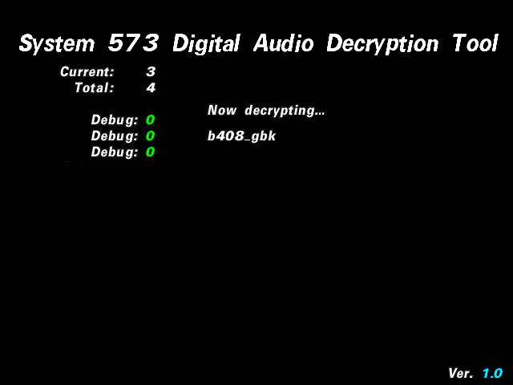

# System 573 Digital Audio Decryption Tool

This is based on Drummania 5th Mix.
Drummania 5th mix must be used as the base game when applying the ASM patches or else it won't work.

## Usage

1. Build patch using [armips](https://github.com/Kingcom/armips)
2. Modify dec_list.json to point to whatever files you want to decrypt and with what keys (finding keys is up to you)
3. Build DEC_LIST.BIN using generate_decryption_list.py: `python generate_decryption_list.py --data dm5th-hack --list dec_list.json`
4. Generate ISO and burn
5. Run on hardware
6. ??? (Whatever it is you want to do at this point)

## TODO

- Rewrite code to allocate less space for filenames
    - This should allow for more songs to be decrypted at once because the allocated space for FRE_LIST.BIN isn't large
- Ability to pause/resume decryption based on a key press?
